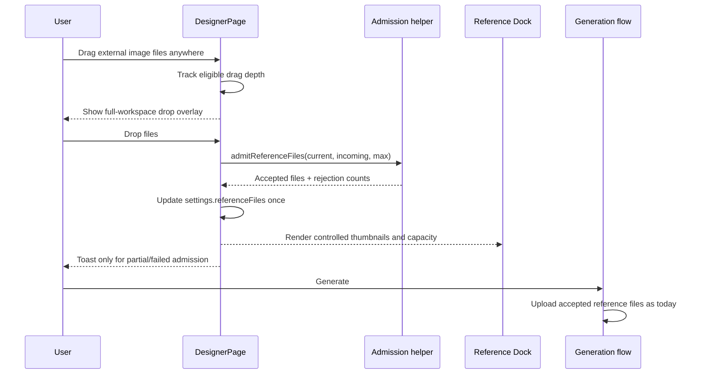

# Designer Smart Reference Drop Design

**Date:** 2026-07-10
**Status:** Approved direction — Scheme C
**Surface:** `studio/src/pages/DesignerPage.tsx` and Designer components

## 1. Objective

Replace the Designer's button-oriented reference-image upload with a studio-native material ingestion experience:

- any external image file dragged anywhere over the Designer workspace can be released to add it as a reference;
- the page provides an unmistakable, full-workspace drop state instead of requiring precise targeting;
- the sidebar reference section becomes a persistent visual material dock rather than an upload button;
- batch filtering, deduplication, provider limits, and feedback are deterministic;
- the existing generated-image, prompt, mask-editing, polling, and generation flows remain unchanged.

The implementation does not preserve the current `上传参考图` button UI. A click/tap file picker remains available through the new dropzone because it is part of the new material-dock interaction and is required for keyboard and touch input, not because the old control is retained.

## 2. Current State

Reference files are owned by `DesignerPage` inside `DesignerSettings.referenceFiles`, but their UI mutation is implemented directly in `DesignerToolbar`:

- a hidden multi-file input is opened by a small ghost button;
- selected files are appended and sliced to `capabilities.maxReferenceImages`;
- object URLs are created inside the toolbar for thumbnail previews;
- there is no drag-and-drop interaction;
- invalid files, duplicate files, and overflow are silently accepted or truncated;
- the mobile toolbar does not expose reference materials.

This design moves reference-file admission into one explicit path and leaves the toolbar responsible only for composing the material dock.

## 3. Chosen Experience

### 3.1 Full-workspace smart drop target

The root Designer workspace is the primary drop target. The user may drag external image files over the canvas, prompt bar, sidebar, or empty space without aiming at a small control.

When a file drag first enters the page:

- the Designer enters `external-file-drag-active` state;
- a full-workspace overlay appears above normal page chrome;
- the overlay communicates that release will add reference images;
- the overlay displays the number of incoming image files when available;
- the overlay displays remaining provider capacity;
- normal controls remain visually visible beneath the overlay, but do not receive the drop.

The overlay disappears when:

- the final tracked drag target leaves the page;
- the files are dropped;
- the user presses Escape;
- the active provider no longer supports references or has no remaining capacity.

Only drags containing the `Files` data-transfer type activate this state. Text selection, links, internal thumbnails, generated images, and other page-native drags must not activate it.

### 3.2 Drag-depth state machine

Nested DOM elements generate multiple `dragenter` and `dragleave` events. A single boolean would make the overlay flicker while the pointer moves across descendants.

The page therefore maintains a drag-depth counter:

1. eligible `dragenter`: increment depth;
2. transition from depth `0` to `1`: show overlay;
3. eligible `dragleave`: decrement depth, never below zero;
4. transition to depth `0`: hide overlay;
5. `drop`, Escape, provider change, or unmount: reset depth and overlay state.

`dragover` calls `preventDefault()` only for eligible file drags so the browser permits dropping without interfering with unrelated drag behavior.

### 3.3 Reference material dock

The sidebar reference section becomes `DesignerReferenceDock`.

#### Empty state

The dock renders one clear drop surface:

- dashed or softly illuminated border;
- image-stack/upload icon;
- primary copy: `拖入参考图`;
- secondary copy: `或点按浏览 · 最多 N 张`;
- the entire surface is interactive, not a small inner button;
- drag-over state raises contrast and uses the existing Studio primary/chart color language.

#### Populated state

The dock renders:

- a three-column square thumbnail grid on desktop;
- one tile per accepted file;
- an add-more tile as the final grid item while capacity remains;
- count and remaining capacity in the section header;
- file name available through accessible text or tooltip;
- remove action visible on hover and keyboard focus;
- a clear full-capacity state when no more files can be added.

There is no separate legacy upload button beneath the grid.

#### Touch/narrow layout

Because touch devices do not provide desktop file dragging, the mobile Designer panel exposes the same material collection as a compact horizontal rail:

- thumbnail tiles scroll horizontally;
- the first empty tile or final add-more tile opens the file picker;
- the same admission and limit rules apply;
- no second reference-file state is introduced.

### 3.4 Visual behavior

The full-workspace overlay should feel like an intentional Studio mode rather than a browser upload affordance:

- translucent `background`/`card` color mixed with a subtle primary-to-chart gradient;
- one large rounded dashed frame inset from the viewport edge;
- centered icon, action label, incoming count, and remaining capacity;
- mild scale/fade transition with reduced-motion support;
- no continuous expensive animation;
- sufficient contrast in light and dark themes;
- `pointer-events: none` for the visual layer, with drop handling attached to the stable page root.

No new visual dependency is required. Existing Tailwind utilities, Lucide icons, and CSS transitions are sufficient. Motion may be used only if it materially improves state entry/exit without complicating tests or reduced-motion behavior.

## 4. File Admission Rules

All ingestion paths — full-page drop, dock drop, file-picker change, and mobile picker — call the same pure admission function.

### 4.1 Accepted files

A file is accepted when:

- `file.type` starts with `image/`; or
- if a browser supplies an empty MIME type, the filename has a known image extension supported by the existing upload endpoint.

The implementation must not attempt to upload or decode files during admission. Backend upload remains deferred until generation, matching the current Designer lifecycle.

### 4.2 Deduplication

Files are considered duplicates when the tuple below matches an existing or earlier incoming file:

```text
name + size + lastModified + type
```

The first occurrence wins and order remains stable. Content hashing is intentionally excluded because it would add latency and memory cost to a pre-upload interaction.

### 4.3 Provider capacity

The active provider capability remains authoritative:

```text
maxReferenceImages
```

Admission fills only remaining slots. Excess files are reported rather than silently sliced.

When a provider change lowers the maximum below the current reference count, the Designer retains the first N files in stable order and reports how many were removed. This prevents an invalid generation request while keeping behavior deterministic.

If the active provider does not support reference images:

- the dock is not rendered;
- the full-page drop state does not activate;
- existing files are intentionally cleared when switching to a provider that cannot accept references; supporting providers retain up to their own maximum as described above.

### 4.4 Admission result

The pure function returns structured information rather than triggering UI side effects:

```ts
interface ReferenceAdmissionResult {
  files: File[]
  accepted: number
  rejectedNonImages: number
  rejectedDuplicates: number
  rejectedOverflow: number
}
```

The React layer updates state once and derives one concise feedback message from the result.

### 4.5 User feedback

No message is needed for an entirely successful admission. Partial or failed admission uses a warning/error toast with concrete counts, for example:

- `已添加 8 张，忽略 2 个非图片文件`
- `已添加 3 张，另外 4 张超过当前模型的 16 张上限`
- `这些图片已经在参考素材中`
- `参考图已达到当前模型上限`

The interface must never silently discard files.

## 5. Component Architecture

### 5.1 `reference-files.ts`

New pure module responsible for:

- detecting supported image files;
- producing a stable file identity;
- deduplicating against current and incoming files;
- applying provider capacity;
- returning `ReferenceAdmissionResult`;
- formatting admission feedback if a separate formatting helper improves tests.

This module contains no React, toast, DOM, or object-URL behavior.

### 5.2 `DesignerReferenceDock.tsx`

New controlled component with responsibilities:

- render empty, populated, add-more, and full states;
- own the hidden input element and reset its value after each selection;
- forward files selected through its picker via `onFilesAdded`;
- render thumbnails from provided files;
- create and revoke preview object URLs safely;
- remove files through `onFileRemove`;
- provide desktop grid and narrow horizontal presentation;
- expose accessible names and keyboard interaction.

Representative contract:

```ts
interface DesignerReferenceDockProps {
  files: File[]
  maxFiles: number
  onFilesAdded: (files: File[]) => void
  onFileRemove: (index: number) => void
  compact?: boolean
}
```

The dock does not apply deduplication or limits itself. The stable Designer page root owns all drag/drop events, including drops visually made over the dock, while the dock delegates picker selections to the same page-owned callback. This avoids duplicate processing from bubbled drop events and guarantees every ingestion path has identical semantics.

### 5.3 `DesignerDropOverlay.tsx`

New presentational component responsible for:

- full-workspace drop-mode visuals;
- incoming eligible image count when available;
- remaining-capacity copy;
- full-capacity copy if a drag becomes active immediately before capacity changes;
- no event listeners and no reference-file mutation.

Representative contract:

```ts
interface DesignerDropOverlayProps {
  active: boolean
  incomingCount?: number
  remainingCapacity: number
}
```

### 5.4 `DesignerPage.tsx`

`DesignerPage` remains the single owner of `DesignerSettings.referenceFiles` and gains responsibility for:

- the shared `addReferenceFiles(files)` admission callback;
- toast feedback derived from admission results;
- drag-depth and overlay state;
- page-root drag/drop/keyboard handlers;
- provider-capacity normalization when model selection changes;
- passing controlled reference props into the toolbar;
- rendering `DesignerDropOverlay` at the page root.

The callback uses a functional `setSettings` update so drops cannot append against stale state.

### 5.5 `DesignerToolbar.tsx`

The toolbar:

- removes its current `refInputRef`, `handleRefFiles`, preview URL effect, and inline reference markup;
- receives controlled reference callbacks from the page;
- renders `DesignerReferenceDock` in the desktop reference section;
- renders the compact dock/rail in its existing mobile panel;
- keeps all unrelated provider, size, quality, count, format, compression, watermark, credit, and history behavior unchanged.

## 6. Event and Data Flow



## 7. Error and Edge Cases

- **No active provider yet:** do not activate the overlay; provider loading remains visually stable.
- **Provider supports zero references:** do not activate or render the dock.
- **Capacity already full:** show a full-capacity response and do not mutate files.
- **Drop contains directories:** ignore entries that do not resolve to image `File` objects; no directory traversal.
- **Drop contains mixed images and other files:** accept valid images, report invalid count.
- **Same file selected twice:** keep one occurrence and report duplicates.
- **Object URL lifecycle:** revoke every URL on file-list change and unmount.
- **Fast repeated drops:** use functional state updates to avoid lost or duplicated files.
- **Nested drag events:** use depth tracking and hard reset on drop/Escape.
- **Internal image dragging:** do not activate without the external `Files` data-transfer type.
- **Mask editing:** global drop remains available, but dropping references must not close or mutate the active mask editor.
- **Generation in progress:** references may still be edited only if current product behavior permits settings changes; this change does not introduce a new generation lock.

## 8. Accessibility

The new interaction is drag-first, not drag-only:

- the dock surface is a real button or label-backed interactive control;
- Enter/Space opens file selection;
- input accepts multiple images;
- removal controls have names such as `移除参考图：filename.png`;
- focus-visible styling is as clear as drag-over styling;
- state text exposes current count and maximum;
- visual overlay is decorative/state feedback and does not trap focus;
- animation respects `prefers-reduced-motion`.

This is part of the new design quality bar and not compatibility with the old upload button.

## 9. Test Strategy

Implementation follows TDD.

### 9.1 Pure unit tests

Create `reference-files.test.ts` covering:

- accepts multiple image files in stable order;
- rejects non-image files;
- accepts configured image extensions when MIME type is empty;
- deduplicates against current files;
- deduplicates within one incoming batch;
- applies remaining provider capacity;
- reports all rejection counts;
- returns the unchanged list when capacity is full.

### 9.2 Dock component tests

Create `DesignerReferenceDock.test.tsx` covering:

- renders the empty drop surface and maximum count;
- file input selection calls `onFilesAdded`;
- picker selection calls `onFilesAdded` with all selected files and resets the input;
- populated state renders thumbnails and add-more tile;
- remove action reports the correct index;
- full state removes/disables add-more behavior;
- object URLs are revoked when previews change/unmount;
- compact mode renders the touch/narrow rail.

### 9.3 Page integration tests

Extend the Designer provider contract test or add a focused page test covering:

- eligible dragenter shows the workspace overlay;
- nested enter/leave does not flicker;
- drop anywhere, including over the dock, is handled once and updates the dock;
- Escape clears drag state;
- text/internal drag does not activate;
- provider maximum is enforced;
- switching to a lower-capacity provider normalizes the current file list;
- provider without reference support does not activate the drop experience.

### 9.4 Static clarity checks

Keep the existing dark-mode clarity assertions passing. New classes must not reintroduce prohibited low-contrast Designer tokens.

## 10. Browser Verification

Use the in-app Browser against the local Studio dev server and verify:

1. Designer route identity and no blank/error overlay;
2. empty material dock in light and dark themes;
3. external image drag over canvas shows the full-workspace overlay;
4. moving across nested canvas/sidebar elements does not flicker;
5. dropping multiple images renders all accepted thumbnails;
6. adding more through the final tile uses the same behavior;
7. mixed/duplicate/overflow input produces clear feedback;
8. delete action updates count and restores capacity;
9. full-capacity state is obvious;
10. prompt entry and generation controls still function;
11. mask-editing surface is not dismissed by reference ingestion;
12. narrow viewport exposes the compact reference rail without clipping.

## 11. Verification Commands

```bash
cd studio && bun run test
cd studio && bun run build
```

Focused tests should be run during the red-green loop before the full suite.

## 12. Non-Goals

This change does not:

- upload files immediately on selection;
- add remote URL ingestion;
- add image annotations, roles, or page binding;
- add thumbnail reordering;
- persist reference files across reloads;
- change backend upload contracts;
- change image-generation request shape;
- change generated-image drag behavior;
- modify shared `studio/src/components/ui/*` primitives;
- introduce a new drag-and-drop library.

## 13. Acceptance Criteria

The design is complete when:

- the old `上传参考图` button UI no longer exists;
- an external image can be dropped anywhere within the Designer workspace;
- eligible dragging produces a stable full-workspace visual mode;
- all ingestion paths share filtering, deduplication, capacity, and feedback rules;
- the sidebar functions as a persistent reference material dock;
- touch/narrow layout can add and review reference images;
- no file is silently discarded;
- current generation behavior receives the same ordered `File[]` data it expects;
- focused tests, the full Studio test suite, Studio build, and browser interaction verification pass.
